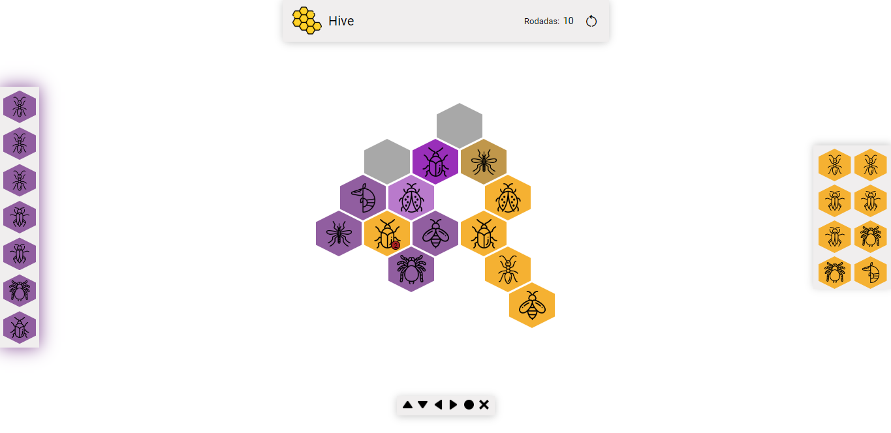

# HivePocket Local

HivePocket Local é um jogo de navegador local para dois jogadores baseado no jogo HivePocket original. Ele foi desenvolvido em HTML/CSS e JavaScript (com a biblioteca Jquery), e destina-se a fins de entretenimento.

## Objetivo do Projeto

O objetivo principal foi desenvolver a lógica e conhecer melhor o jQuery para a resolução de problemas. Outro motivo é criar uma opção intuitiva do jogo para pessoas que estão aprendendo a jogar.

## Como Jogar

No menu inicial, você insere o nome do primeiro e segundo jogador e escolhe quais expansões (Joaninha, Tatuzinho, Mosquito) estarão disponíveis no jogo.

## Objetivo do Jogo

Cada jogador procura cercar completamente a abelha do adversário, enquanto tenta impedir que o adversário faça o mesmo. O primeiro jogador a cercar completamente a abelha do adversário ganha a partida.

> Se ambas as abelhas forem cercadas ao mesmo tempo, o jogo termina empatado.

## Desenvolvimento da partida

A partida começa com o jogador amarelo colocando uma de suas peças no centro da mesa. Em seguida, o adversário também coloca uma de suas peças na mesa, de forma que se conecte a um dos lados da peça já colocada. Os jogadores alternam as vezes para colocar ou mover uma das peças já colocadas na mesa.

## Inserindo peças na mesa

Uma peça pode ser colocada em jogo a qualquer momento. No entanto, com exceção do primeiro turno de cada jogador, as peças não podem ser colocadas em contato com as peças do adversário. Uma vez colocada, uma peça não pode ser retirada do jogo.

> As peças colocadas na mesa formam a colmeia, definindo o terreno do jogo.

## Colocação da abelha

A abelha pode ser colocada em jogo a qualquer momento durante os três primeiros turnos. Se no quarto turno a abelha ainda não foi colocada em jogo, o jogador é obrigado a fazê-lo neste turno.

## Movendo as peças

Após a abelha ser colocada em jogo, um jogador pode escolher entre colocar outra peça em jogo ou mover uma das peças já em jogo. Cada inseto tem sua própria forma de se mover na colmeia e pode até se mover para posições que estão em contato com as peças do adversário.

> Todas as peças devem sempre estar em contato com pelo menos uma outra peça.

## Restrições

### Regra da colmeia indivisível

As peças em jogo devem permanecer sempre conectadas. Em nenhum momento pode-se deixar uma peça isolada ou dividir a colmeia em duas.

Mover uma peça de forma que ela se reconecte com a colmeia também não é permitido, pois a colmeia nunca pode ser separada em duas, nem mesmo por um momento.

### Liberdade de movimento

Os insetos podem se mover apenas deslizando sobre a mesa. Se uma peça está rodeada por outras a ponto de não conseguir deslizar para outra posição, ela não pode se mover. Da mesma forma, uma peça não pode entrar em um espaço para o qual não pode deslizar. As exceções são o Gafanhoto, Besouro, Joaninha e Mosquito (dependendo da peça que ele copiar).

> Quando colocada em jogo pela primeira vez, ela pode ser colocada em um espaço rodeado, desde que não viole as regras de "Inserindo peças na mesa".

### Impossibilidade de colocar ou mover uma peça

Se um jogador não consegue colocar uma nova peça ou mover uma peça já colocada, ele deve passar a vez para o adversário, que jogará novamente. A partida continua dessa forma até que o jogador possa colocar ou mover uma de suas peças, ou até que a partida termine.

## Insetos

### Abelha

A abelha pode mover-se um espaço por vez.

> 1 abelha para cada jogador (total de 2)

### Besouro

O Besouro, assim como a abelha, move-se um espaço por vez. No entanto, ele também pode subir em cima de outra peça na colmeia. Uma peça que esteja abaixo do besouro não pode mover-se, e a pilha toma a cor da peça no topo. A partir de sua posição no topo, o besouro pode mover-se de peça em peça por cima da colmeia. Ele também pode descer para espaços vazios, rodeados ou não por outras peças. A única forma de bloquear um Besouro é colocando outro besouro em cima dele. Quando colocado pela primeira vez, ele é colocado de acordo com as regras das demais peças.

> 2 besouros para cada jogador (total de 4)

### Gafanhoto

O gafanhoto salta da sua posição por cima de uma peça adjacente para o próximo espaço vazio ao longo de uma linha reta de peças conectadas. Dessa forma, ele consegue preencher um espaço vazio que esteja rodeado por outras peças.

> 3 gafanhotos para cada jogador (total de 6)

### Aranha

A aranha avança três espaços de cada vez. Ela deve avançar em um percurso direto, não podendo voltar para trás na mesma jogada. Ao mover-se, ela deve sempre manter contato com outras peças da colmeia e não pode atravessar um espaço vazio que perca momentaneamente o contato com outras peças.

> 2 aranhas para cada jogador (total de 4)

### Formiga

A formiga pode mover-se da sua posição para qualquer outra posição na colmeia, desde que, ao longo do caminho, ela mantenha sempre contato com as peças da colmeia.

> 3 formigas para cada jogador (total de 6)

## Expansões

### Joaninha

A joaninha deve mover-se exatamente três espaços: dois por cima da colmeia e outro para descer. Ela deve mover-se exatamente dois espaços para cima da colmeia e, em seguida, encerra o movimento descendo. A joaninha não pode mover-se ao redor da colmeia nem terminar seu movimento em cima da colmeia.

> 1 joaninha para cada jogador (total de 2)

### Tatuzinho

O Tatuzinho avança um espaço por vez, mas também possui uma habilidade especial que pode ser usada em vez de avançar. A habilidade especial permite ao Tatuzinho mover uma peça adjacente (de qualquer cor) para outro espaço vazio adjacente, respeitando algumas restrições:

* O Tatuzinho não pode mover uma peça que acabou de ser jogada pelo adversário;
* O Tatuzinho não pode mover nenhuma peça que esteja em uma pilha;
* O tatuzinho não pode mover uma peça que quebre a colmeia.

> 1 tatuzinho para cada jogador (total de 2)

### Mosquito

O mosquito copia o movimento de uma peça adjacente, incluindo peças do adversário. A exceção ocorre quando o mosquito copia o movimento do besouro e fica em cima da colmeia; nesse caso, o mosquito deve permanecer como um besouro até que desça da colmeia. Se o mosquito estiver em contato com uma pilha de insetos, ele copia a peça que está no topo da pilha. Se o mosquito estiver em contato com outro mosquito, ele não pode mover-se. O mosquito em contato com o Tatuzinho pode copiar apenas o movimento dele, mas não pode copiar a habilidade especial do Tatuzinho.

> 1 Mosquito para cada jogador (total de 2)

## Considerações Finais e Continuidade do Projeto

O HivePocket Local é um jogo de navegador desenvolvido para dois jogadores com base no jogo original HivePocket. Ele foi criado com o objetivo de desenvolver a lógica e aprofundar o conhecimento do jQuery para a resolução de problemas. Além disso, o jogo foi projetado para oferecer uma opção intuitiva para pessoas que estão aprendendo a jogar.

No momento, o jogo possui as regras e peças descritas, permitindo aos jogadores colocar seus nomes, escolher as expansões e jogar alternadamente, colocando e movendo peças na colmeia. O objetivo é cercar completamente a abelha do adversário, enquanto se evita que o adversário faça o mesmo. O primeiro jogador a cercar completamente a abelha do oponente vence a partida.

Possíveis adições futuras para o projeto podem incluir a implementação do modo online, permitindo que os jogadores joguem em diferentes locais, bem como a adição de outras peças criadas pelos próprios jogadores.

## Créditos

As regras do jogo foram inspiradas nas regras do jogo original HivePocket e suas expansões, com pequenas modificações descritas neste texto.
